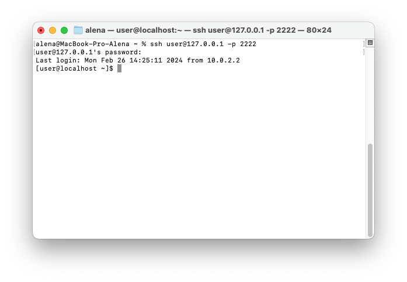
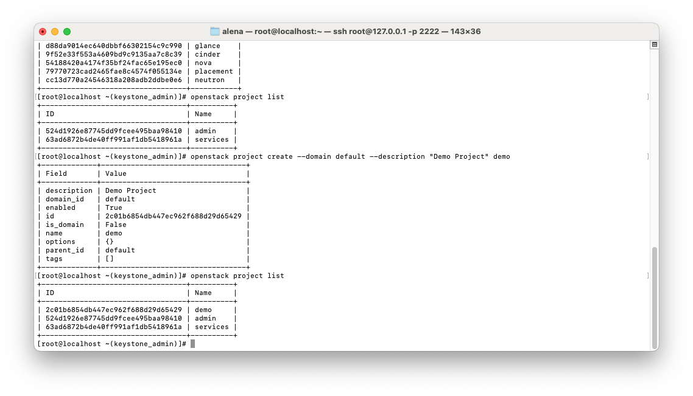

Author: Тимоненко Н.А. гр. К4112С, Смирнов Г.А. гр. К4113С
Lab: Lab1
# Лабораторная работа №1 Подготовка к развертыванию OpenStack
## Ход работы
1. Создание ВМ на базе alma linux3.


2. Подключение к ВМ через ssh


3. Установка git
```
sudo dnf install git -y
```


4. Клонирование проекта openstack_lab
```
git clone https://gitlab.com/itmo_samon/openstack_lab.git
```


5. Выполнить prepare.sh
```
[user@localhost openstack_lab]$ sudo ./prepare.sh
```


6. Выполнить config.sh
```
[user@localhost openstack_lab]$ sudo ./config.sh
```


7. Установить OpenStack
```
[user@localhost openstack_lab]$ sudo packstack --answer-file=answer.cfg
```


8. Данные для входа
```
[user@localhost home]$ sudo cat /root/keystonerc_admin
```


9. Загрузка данных для входа в переменные среды
```
[root@localhost ~]# source /root/keystonerc_admin
```


10. openstack endpoint list
```
[root@localhost ~]# openstack endpoint list
```


11. openstack user list
```
[root@localhost ~]# openstack user list
```


12. openstack project list
```
[root@localhost ~]# openstack project list
```


13. openstack project create --domain default --description "Demo Project" demo
```
[root@localhost ~]# openstack project create --domain default --description "Demo Project" demo
```


14. openstack project list
```
[root@localhost ~]# openstack project list
```


15. Авторизация на localhost:8080 с учетными данными admin


16-17. Создание проекта и пользователя в интерфейсе Horizon. Добавить пользователю роль в проекте.

[root@localhost ~]# openstack project list && openstack user list


18. Авторизация под созданными пользователем - виден только проект, к которому относится пользователь.


## Выводы
1. Развернута ВМ на базе образа Alma Linux 9.3
2. Настройка среды для установки Openstack
3. Установка OpenStack
4. Изучены возможности OpenStack CLI
5. Вход в Openstack через Horizon
6. Изучены способы создания проектов и пользователей