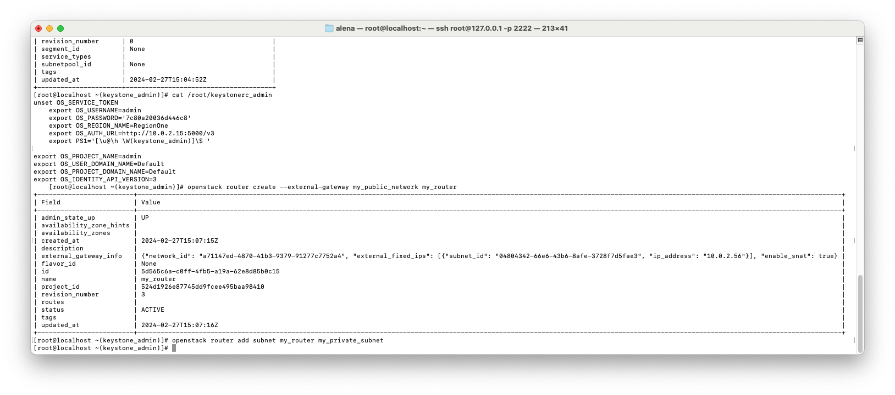

Author: Тимоненко Н.А. гр. К4112С, Смирнов Г.А. гр. К4113С
Lab: Lab2
# Лабораторная работа №2
## Ход работы
1. Загрузка данных для входа в переменные среды.
```
source /root/keystonerc_admin
```


2. Создать сеть провайдера.
```
[root@localhost ~(keystone_admin)]# openstack network create --external --default --provider-network-type flat --provider-physical-network br-ex my_public_network
```


3. Создать подсеть в сети провайдера.
```
[root@localhost ~(keystone_admin)]# IP=`/sbin/ip route | awk '/default/ { print $3 }'`
[root@localhost ~(keystone_admin)]# baseIP=`echo $IP | cut -d"." -f1-3`
[root@localhost ~(keystone_admin)]# openstack subnet create --allocation-pool start=$baseIP.50,end=$baseIP.60 --no-dhcp --subnet-range $baseIP.0/24 --gateway $IP --network my_public_network --dns-nameserver 1.1.1.1 my_public_subnet
```


4. Создать локальную сеть и подсеть.
```
[root@localhost ~(keystone_admin)]# openstack network create --internal my_private_network
[root@localhost ~(keystone_admin)]# openstack subnet create --subnet-range 172.17.22.0/24 --network my_private_network --dns-nameserver 1.1.1.1 my_private_subnet
```


5. Создать роутер и подключить созданные сети.
```
[root@localhost ~(keystone_admin)]# openstack router create --external-gateway my_public_network my_router
[root@localhost ~(keystone_admin)]# openstack router add subnet my_router my_private_subnet
```





6. Создать флейвор виртуальной машины.
```
[root@localhost ~(keystone_admin)]# openstack flavor create --ram=256 my_tiny_flavor
```


7. Создать ключевую пару.
```
[root@localhost ~(keystone_admin)]# openstack keypair create --public-key ~/.ssh/id_rsa.pub my_key
```


8. Загрузить образ Cirros в OpenStack Glance.
```
[root@localhost ~(keystone_admin)]# wget http://download.cirros-cloud.net/0.6.2/cirros-0.6.2-x86_64-disk.img
[root@localhost ~(keystone_admin)]# openstack image create --disk-format qcow2 --public --file ./cirros-0.6.2-x86_64-disk.img my_cirros_image
```


9. Создать блочное устройство в Cinder.
```
[root@localhost ~(keystone_admin)]# openstack volume create --size 2 --image my_cirros_image --bootable my_disk
```


10. Создать ВМ в Horizon.


11. Открыть консоль созданной ВМ


12. Проверить адрес ВМ на валидность. Как видно, 172.17.22.76 принадлежит пулу приватной сети.


13. Через Horizon создать еще одну приватную сеть+подсеть (адресация любая), подключить ее к уже существующему роутеру


14. Через Openstack CLI сделать копию ранее созданного блочного устройства
```
[root@localhost ~(keystone_admin)]# openstack volume create --source my_disk my_test_disk
```


15. Через Openstack CLI создать еще одну ВМ.
```
[root@localhost ~(keystone_admin)]# openstack server create --flavor my_tiny_flavor --volume my_test_disk --network my_private_net_test1 --key my_key NewVM
```


16. Проверить, что все работает, на новой, созданной ВМ. IP 174.14.23.71 принадлежит новой подсети.


## Вопросы
### 1. Что именно сервис с помощью Keystone проверяет в токене пользователя, когда тот пытается осуществить операцию по отношению к этому сервису?

Проверяется:
1) Валидность токена (напр. срок действия, принадлежность пользователю);
2) Возможность выполнять запрашиваему операцию для данного пользователя;
3) Возможность выполнять запрашиваему операцию для проекта пользователя;

### 2. При создании ВМ, Nova первым делом идет в Keystone, проверяет токен и т.д. Как думаете, к эндпоинту какого сервиса Nova идет следом?

Предполагаю, что glance - получение информации об образе и метаданных. Шел от обратного - не сеть, ее нет смысла создавать в начале, не дисковое хранилище - еще не обработана информация об создаваемой сущности.

