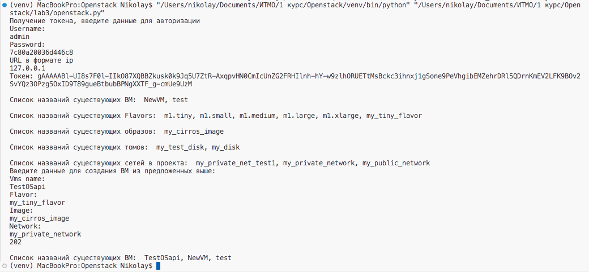
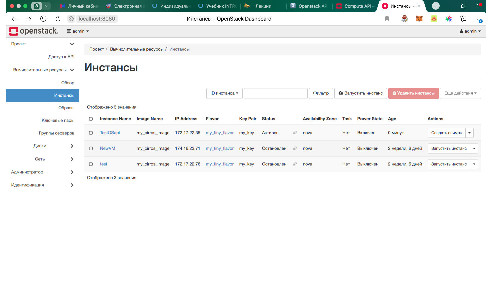
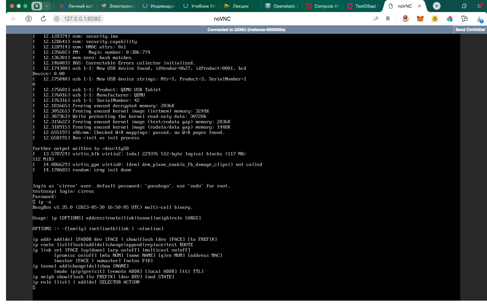

Author: Тимоненко Н.А. гр. К4112С, Смирнов Г.А. гр. К4113С
Lab: Lab3
# Лабораторная работа №3 Работа с Openstack API
## Ход работы
Работа выполнена в виде передачи http - запрососв к API Openstack в файле openstack.py. Последовательность работы:

1. Авторизация и post-запрос токена по эндпойнту `http//127.0.0.1:5000/v3/auth/tokens` с помощью вводимых пользователем учетных данных.

2. Запрос списка существующих ВМ в функции get_server_list через get-запрос по эндпойнту `http//127.0.0.1:8774/v2.1/servers` с авторизацией по полученному в п. 1 токену.

3. Запрос списка существующих Flavors в функции get_flavor_list через get-запрос по эндпойнту `http//127.0.0.1:8774/v2.1/flavors` с авторизацией по полученному в п. 1 токену.

4. Запрос списка существующих образов в функции get_image_list через get-запрос по эндпойнту `http//127.0.0.1:8774/v2.1/images` с авторизацией по полученному в п. 1 токену.

5. Запрос списка существующих Volumes в функции get_volume_list через get-запрос по эндпойнту `http//127.0.0.1:8774/v2.1/os-volumes` с авторизацией по полученному в п. 1 токену.

6. Запрос списка существующих сетей в функции get_network_list через get-запрос по эндпойнту `http//127.0.0.1:8774/v2.1/os-tenant-networks` с авторизацией по полученному в п. 1 токену.

7. Функция преобразования имени/тэга в id ресурса для более точной индетефикации.

8. Запрос у пользователя ресурсом для создании ВМ на основании ранее выведенных списков.

9. Создание ВМ чере post-запрос в функции create_server к эндпойнту `http//127.0.0.1:8774/v2.1/servers` на основе предоставленных пользователем данных и токена, полученного п. 1.

10. В результат получен ответ со статусом 202 и в списке ВМ добавилась машина с именем TestOSapi. Так же эта ВМ доступна через Horizon. Для проверки зайдем в консоль и запросим ip-адрес. Результат работы представлен на скриншотах ниже.

## Вопросы
### 1. Какие протоколы тунеллирования использует Neutron?

1) Generic routing encapsulation (GRE);
2) Virtual extensible local area network (VXLAN);
3) Generic Network Virtualization Encapsulation (GENEVE);

[Источник](https://docs.openstack.org/neutron/2023.2/admin/intro-overlay-protocols.html)

### 2. Можно ли заменить Cinder, например, CEPH-ом? Для чего если да, почему если нет?
 
 Полагаю, что можно использовать CEPH в качестве бэкенда хранения для Cinder, однако польность заменить нельзя, тк cinder отвечает в т.ч. за подключение блочных устрйоств к виртуальным машинам.

